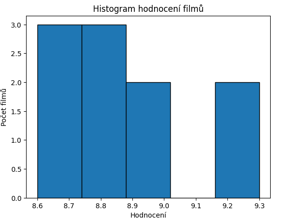

# 🎨 Galerie snímků GUI vytvořených knihovnou Tkinter

Tento repozitář obsahuje galerii obrázků vytvořených studenty.
Každý student má vlastní sekci se svým jménem, odkazem na GitHub
a náhledy obrázků uložených ve složce `images/`.

Pro inspiraci se koukněte na krátků návod ke knihovně [tkinter_tutorial_cz.md](tkinter_tutorial_cz.md)

**Rychlá navigace:**  
[Balanets](#anastasiia-balanets) ·
[Bartuněk](#michael-bartuněk) ·
[Borovička](#ondřej-borovička) ·
[Brož](#adam-brož) ·
[Fenynets](#vitalii-fenynets) ·
[Filip](#tomáš-filip) ·
[Garčic](#vojtěch-garčic) ·
[Horáček](#daniel-horáček) ·
[Hron](#michal-hron) ·
[Jandák](#tomáš-jandák) ·
[Jiránek](#lukáš-jiránek) ·
[Kravets](#maksym-kravets) ·
[Kreperát](#šimon-kreperát) ·
[Kryvka](#karyna-kryvka) ·
[Kubala](#šimon-kubala) ·
[Kubát](#pavel-kubát) ·
[Mandziuk](#mykola-mandziuk) ·
[Mayrhofer](#hynek-mayrhofer) ·
[Miláček](#marek-miláček) ·
[Nahornyi](#mark-nahornyi) ·
[Pavelka](#dominik-pavelka) ·
[Povolný](#antonín-povolný) ·
[Procházka](#vincent-procházka) ·
[Řehák](#marek-řehák) ·
[Sauer](#matyáš-sauer) ·
[Suchánsky](#jakub-suchánsky) ·
[Sunkovský](#tomáš-sunkovský) ·
[Škarvan](#petr-škarvan) ·
[Štěpán](#tomáš-štěpán) ·
[Viták](#jáchym-viták)

---

## Anastasiia Balanets
🔗 https://gist.github.com/qqqwwwaaarr/8836721a765b9ab68eea0549dbb75a66

---

## Michael Bartuněk
🔗 https://github.com/SkyGod934/Michael-Barunek

---

## Ondřej Borovička
🔗 https://github.com/dedeczech/Borovicka

---

## Adam Brož
🔗 https://github.com/Brozovec/broz

---

## Vitalii Fenynets
🔗 https://github.com/Ekzarmfs/Fenynets.git

---

## Tomáš Filip
🔗 https://github.com/tomasfilip2009-ship-it/Tom-Filip

---

## Vojtěch Garčic
🔗 https://github.com/JouJoumanCZ/skola

---

## Daniel Horáček
🔗 https://github.com/Dndskid/Horacek

---

## Michal Hron
🔗 https://github.com/michal670/Hron---repozit-

---

## Tomáš Jandák
🔗 https://github.com/Tjandak/Jandak

---

## Lukáš Jiránek
🔗 https://github.com/MentysTV/Jir-nek-Luk-

---

## Maksym Kravets
🔗 https://github.com/Maomi0906/Kravets-Maksym

---

## Šimon Kreperát
🔗 https://github.com/Simanski7/Kreperat

---

## Karyna Kryvka
🔗 https://github.com/moonlight-898/Karina

---

## Šimon Kubala
🔗 https://github.com/S-1man/ZacatkyPythonu---Kubala

---

## Mykola Mandziuk
🔗 https://github.com/pepsikolya/stocks

---

## Hynek Mayrhofer
🔗 https://github.com/hynekmayrhofer1/Hynek-Mayrhofer

---

## Marek Miláček
🔗 https://github.com/marek-milacek/MMilacek

---

## Mark Nahornyi
🔗 https://github.com/MarkQTN/SPSD-Nahornyi

---

## Pavel Kubát
🔗 https://github.com/Piratesk1/Kubat

---

## Dominik Pavelka
🔗 https://github.com/dominikpavelka1515/Dominik-Pavelka/tree/main

---

## Antonín Povolný
🔗 https://github.com/TondaPovolny/Povolny

---

## Vincent Procházka
🔗 https://github.com/VincentProchazka/Vincent-Prochazka

---

## Marek Řehák
🔗 https://github.com/MarekRehak/-eh-k.git

---

## Matyáš Sauer
🔗 https://github.com/MatyaSau/Sauer

---

## Petr Škarvan
🔗 https://github.com/Petr-Skarvan/skarvan.py

---

## Tomáš Štěpán
🔗 https://github.com/Tomas120cz/Stepan

---

## Jakub Suchánsky
🔗 https://github.com/jakubsuchansky/Suchansky

---

## Tomáš Sunkovský
🔗 https://github.com/TomyssCZ/Tomas-Sunkovsky

---

## Jáchym Viták
🔗 https://github.com/Jachy47/Vitak2

---

