# 🎨 Galerie snímků GUI vytvořených knihovnou Tkinter

Tento repozitář obsahuje galerii obrázků vytvořených studenty.
Každý student má vlastní sekci se svým jménem, odkazem na GitHub
a náhledy obrázků uložených ve složce `images/`.

Pro inspiraci se koukněte na krátků návod ke knihovně [tkinter_tutorial_cz.md](tkinter_tutorial_cz.md)

**Rychlá navigace:**  
[Balanets](#anastasiia-balanets) ·
[Bartuněk](#michael-bartuněk) ·
[Borovička](#ondřej-borovička) ·
[Brož](#adam-brož) ·
[Fenynets](#vitalii-fenynets) ·
[Filip](#tomáš-filip) ·
[Garčic](#vojtěch-garčic) ·
[Horáček](#daniel-horáček) ·
[Hron](#michal-hron) ·
[Jandák](#tomáš-jandák) ·
[Jiránek](#lukáš-jiránek) ·
[Kravets](#maksym-kravets) ·
[Kreperát](#šimon-kreperát) ·
[Kryvka](#karyna-kryvka) ·
[Kubala](#šimon-kubala) ·
[Kubát](#pavel-kubát) ·
[Mandziuk](#mykola-mandziuk) ·
[Mayrhofer](#hynek-mayrhofer) ·
[Miláček](#marek-miláček) ·
[Nahornyi](#mark-nahornyi) ·
[Pavelka](#dominik-pavelka) ·
[Povolný](#antonín-povolný) ·
[Procházka](#vincent-procházka) ·
[Řehák](#marek-řehák--jakub-suchánsky) ·
[Sauer](#matyáš-sauer) ·
[Suchánsky](#marek-řehák--jakub-suchánsky) ·
[Sunkovský](#tomáš-sunkovský) ·
[Škarvan](#petr-škarvan) ·
[Štěpán](#tomáš-štěpán) ·
[Viták](#jáchym-viták)

---

## Anastasiia Balanets
🔗 https://gist.github.com/qqqwwwaaarr/8836721a765b9ab68eea0549dbb75a66

---

## Michael Bartuněk
🔗 https://github.com/SkyGod934/Michael-Barunek

---

## Ondřej Borovička and Šimon Kreperát
🔗 https://github.com/dedeczech/Borovicka
🔗 https://github.com/Simanski7/Kreperat

---

## Adam Brož
🔗 https://github.com/Brozovec/broz 
Nachazí se tam README.md kde vysvetluje vše jak funguje atd a hlavní souborj je hra.py

---

## Tomáš Filip
🔗 https://github.com/tomasfilip2009-ship-it/Tom-Filip

------------
------------

Autoři:
## Vojtěch Garčic
## Tomáš Jandák
## Pavel Kubát

🔗https://github.com/Piratesk1/Kubat/blob/main/to_do_list.py

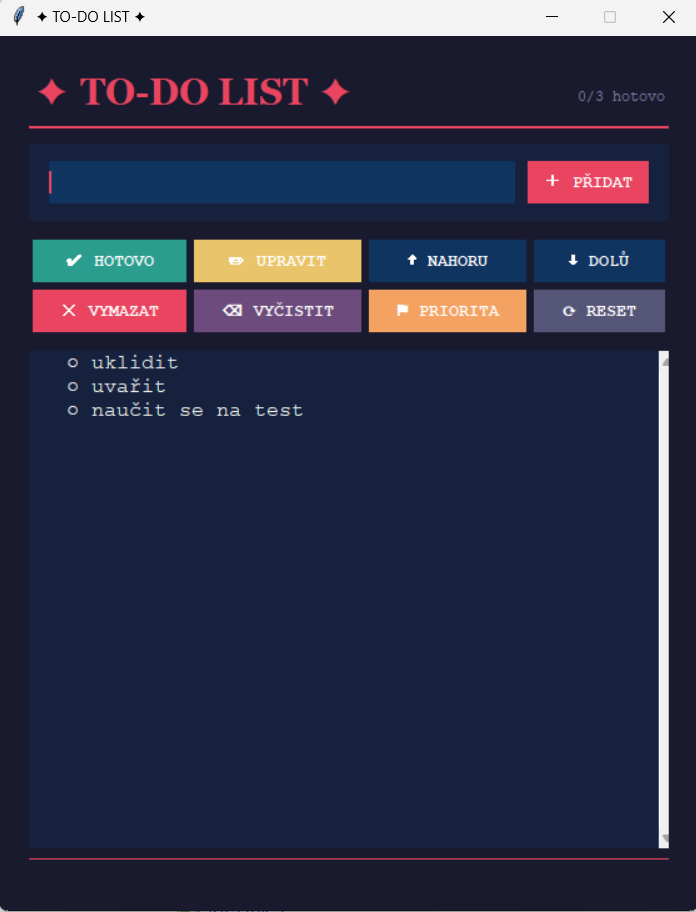

------
------

## Daniel Horáček a Vitalii Fenynets 🥹

🔗 https://github.com/Dndskid/Horacek/blob/main/Elementsio.zip  (Spolupracoval i Vita)

https://elementsio.onrender.com/

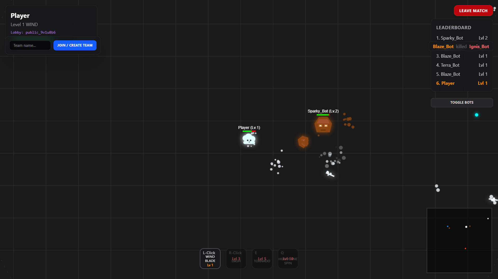

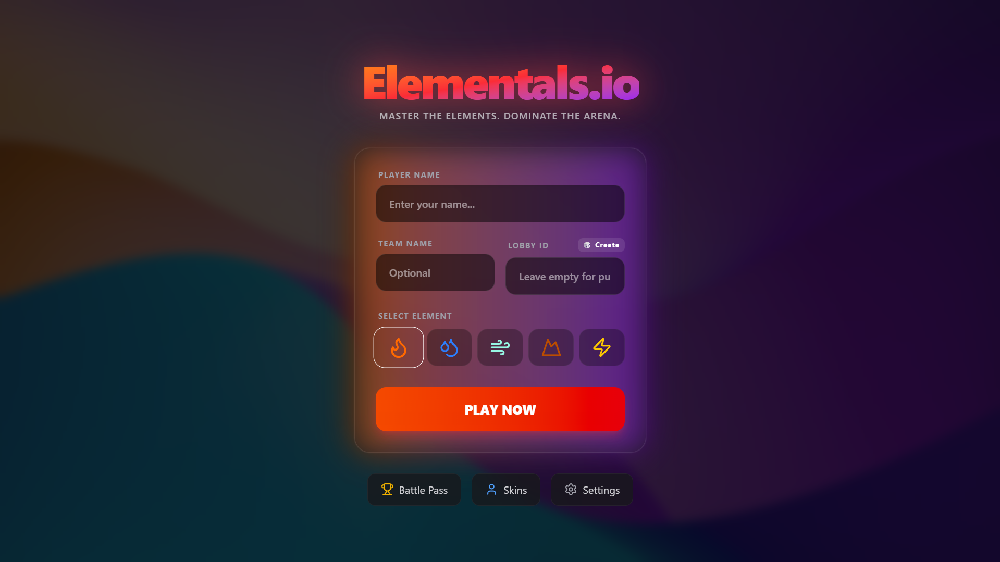

---------
---------

## Michal Hron
🔗 https://github.com/michal670/Hron---repozit-

---

## Lukáš Jiránek
🔗 https://github.com/MentysTV/Jir-nek-Luk-

---

## Maksym Kravets | Karyna Kryvka
🔗 https://github.com/Maomi0906/Kravets-Maksym

🔗 https://github.com/moonlight-898/Karina

|  |  |  |
|-----------|-----------|-----------|
| 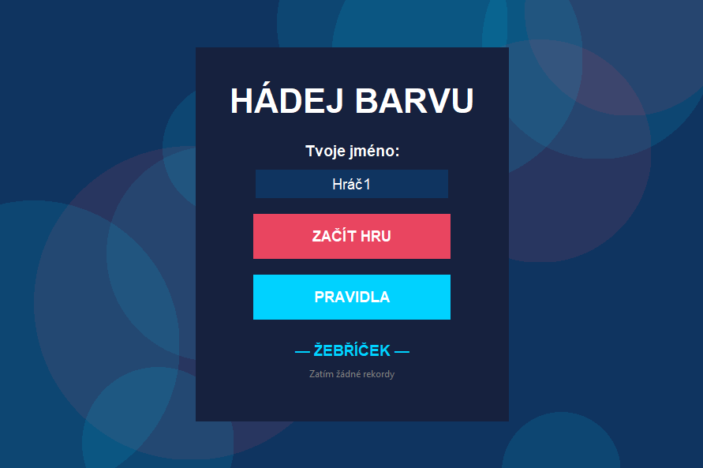  | 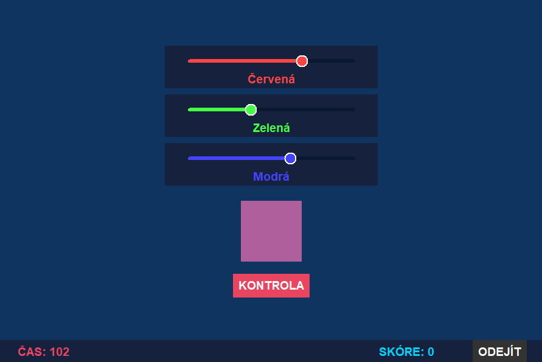  | 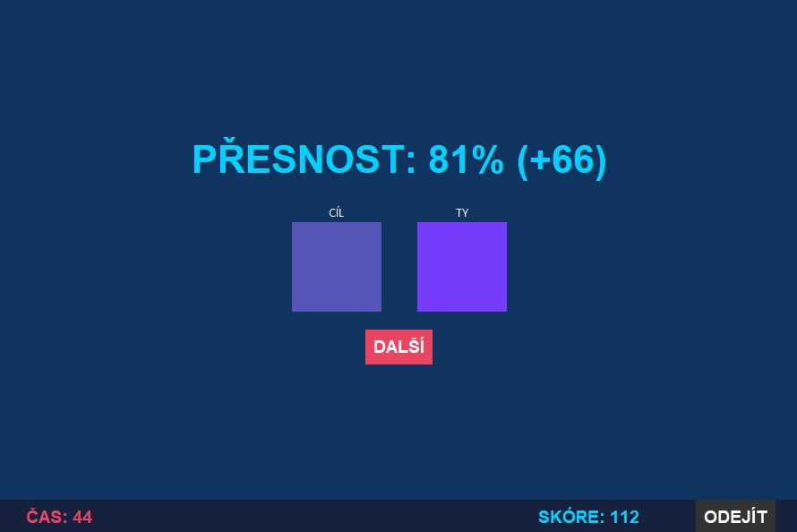  |

---

## Šimon Kubala
🔗 https://github.com/S-1man/ZacatkyPythonu---Kubala

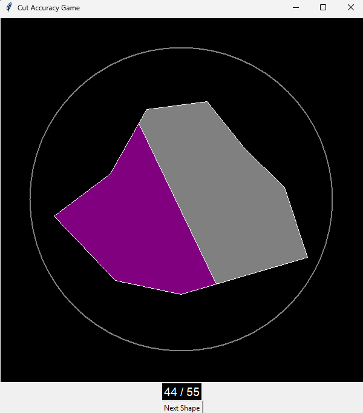

---

## Mykola Mandziuk | Jáchym Viták
🔗 [https://github.com/pepsikolya/tkinterskola]

### President Clicker: Phonk Edition 
 
> **Klikni 100× na prezidenta za 30 sekund. Pohybuje se — buď rychlý!**
 
 
<table>
  <tr>
    <td align="center"><b> Start</b></td>
    <td align="center"><b> Hra</b></td>
    <td align="center"><b> Konec</b></td>
  </tr>
  <tr>
    <td>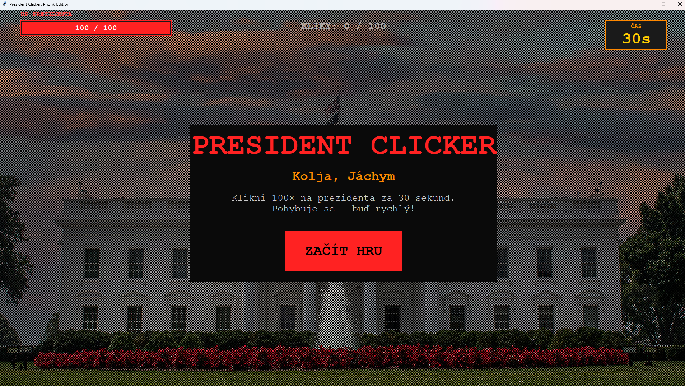</td>
    <td>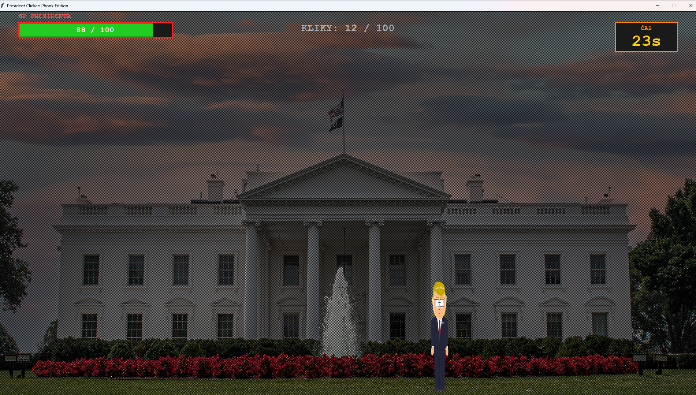</td>
    <td>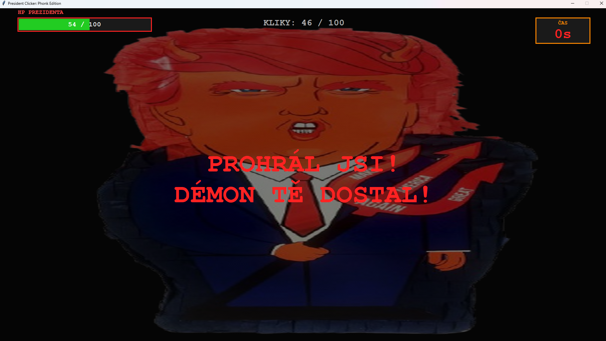</td>
  </tr>
</table>
 

---

## Hynek Mayrhofer
🔗 https://github.com/hynekmayrhofer1/Hynek-Mayrhofer/blob/main/tkinter.ipynb
  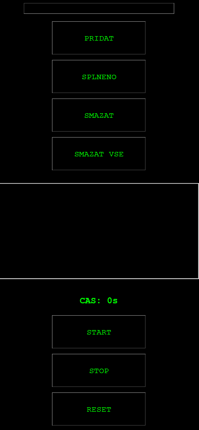
---

## Marek Miláček a Dominik Pavelka
🔗[ https://github.com/marek-milacek/MMilacek](https://github.com/marek-milacek/MMilacek/blob/main/projekt_piskvorky)
🔗[ https://github.com/dominikpavelka1515/Dominik-Pavelka]https://github.com/dominikpavelka1515/Dominik-Pavelka/blob/main/projekt_piskvorky

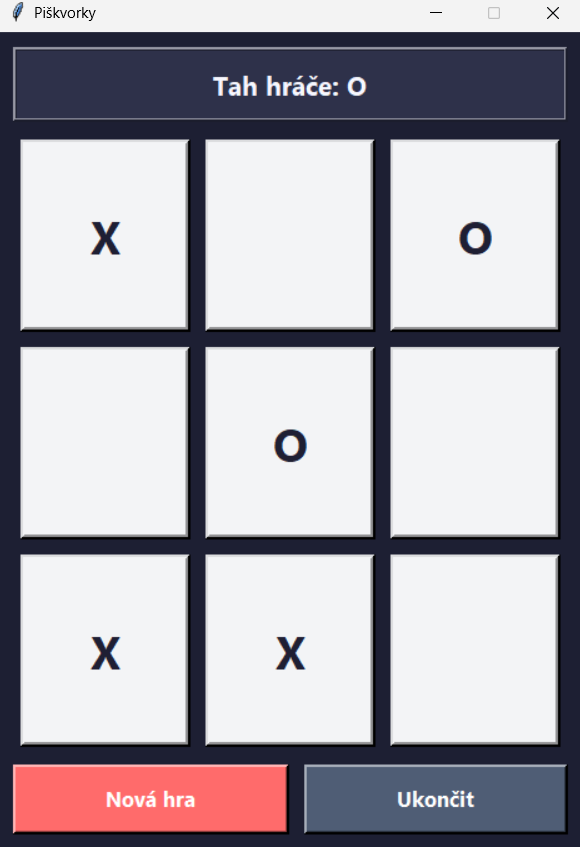

---

## Dominik Pavelka
🔗 https://github.com/dominikpavelka1515/Dominik-Pavelka/tree/main

---

## Petr Škarvan & Antonín Povolný  
🔗 https://github.com/Petr-Skarvan/skarvan/blob/main/CoinFlow.zip
🔗 https://github.com/TondaPovolny/Povolny/blob/main/CoinFlow.zip
NÁVOD
1. Extrahovat
2. Je to main.exe

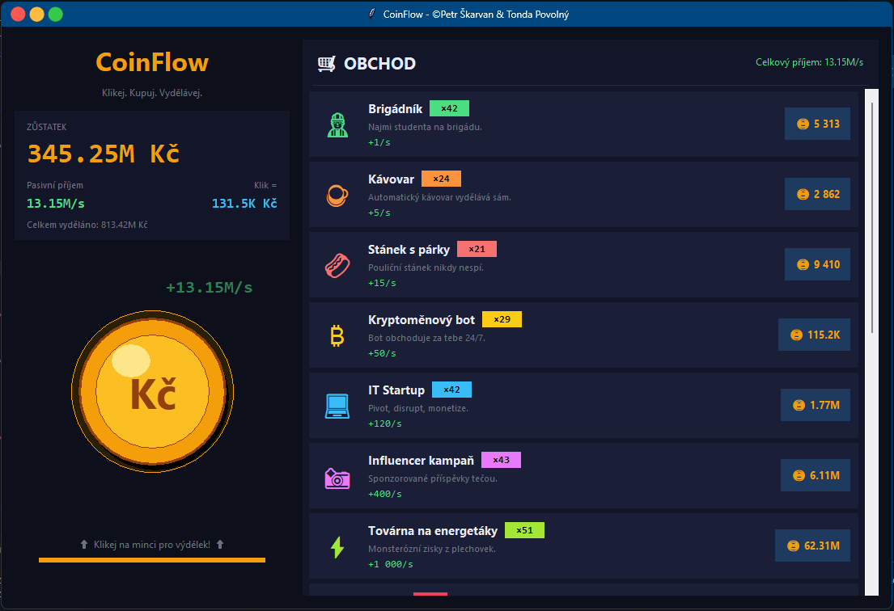

---

## Vincent Procházka
🔗 https://github.com/VincentProchazka/Vincent-Prochazka

---

## Marek Řehák % Jakub Suchánsky
🔗 https://github.com/MarekRehak/-eh-k.git

🔗 https://github.com/jakubsuchansky/Suchansky

🔗 https://github.com/jakubsuchansky/flappy-bird

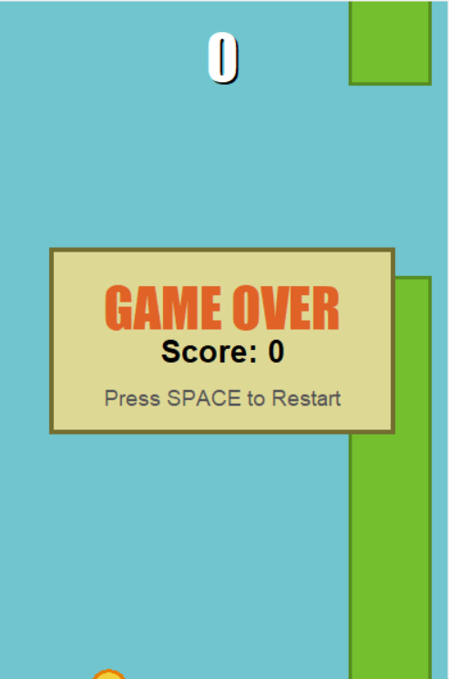

---

## Matyáš Sauer & Mark Nahornyi
🔗 https://github.com/MatyaSau/Sauer

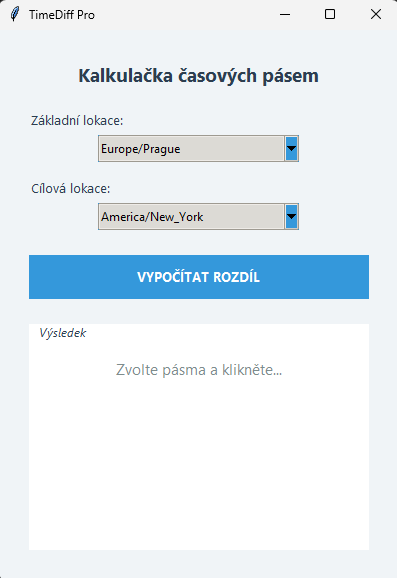

---
---

## Tomáš Štěpán
🔗 https://github.com/Tomas120cz/Stepan

---

## Tomáš Sunkovský
🔗 https://github.com/TomyssCZ/Tomas-Sunkovsky

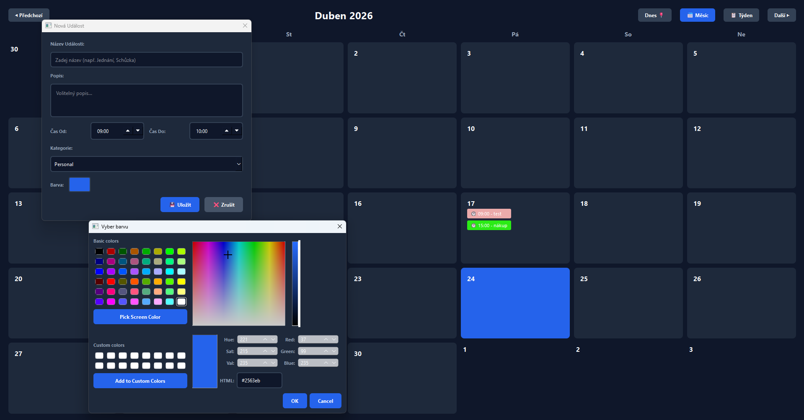

---

## Jáchym Viták
🔗 https://github.com/Jachy47/Vitak2

---

